<p align="center">
  
</p>

# CrowdVault

Crowdfunding where the reward unlocks the moment the money does.

**[Open the vault page](https://adnanekhan.github.io/CrowdVault/)**, or **[try the demo](https://adnanekhan.github.io/CrowdVault/?demo)** with pretend funds.

Creators lock their work (music, art, writing, anything) before the campaign starts. Backers can check that it's there, then chip in. When the goal is reached, a single transaction pays the recipient **and** publishes the key that opens every locked file. Nobody can take the money without unlocking the work, and nobody can unlock the work early without the money being paid.

If the goal is never reached, backers withdraw their money. Nothing is lost.

> **Status:** working prototype. The contracts and cryptography have not been audited. Don't use it for real funds until they are.

## How it works

1. **The coordinator sets up the campaign.** They create a campaign key and put the vault contract on-chain with a goal and a recipient.
2. **Creators lock their files** to the campaign key. Each file becomes a single `.sealed` file they can share anywhere.
3. **Backers check the files and contribute.** A quick check confirms each file really will open when the vault unlocks, before anyone pays.
4. **The goal is reached, and the coordinator claims.** The money goes to the recipient, and the key becomes public in the same transaction.
5. **Everyone opens the files** with the now-public key.

## Who does what

| You are… | You need | Start here |
| --- | --- | --- |
| **The coordinator:** you run the campaign | `vault-seal`, Foundry, a little ETH for gas | [Coordinator guide](docs/coordinator.md), then [Deploying the contracts](docs/deploying.md) |
| **A creator:** you make the work | `vault-seal` and `vault-open` | [Creator guide](docs/creators.md) |
| **A backer:** you fund it | A wallet, the vault page, and `vault-open` | Below |

### For backers

Download `vault-open` ready to run (see [Prebuilt binaries](#prebuilt-binaries)), or build it with [Rust](https://rustup.rs):

```bash
cargo install --path vault-seal --bin vault-open    # from the root of this repo
```

Before contributing, check a file against the key shown on the vault page:

```bash
vault-open verify --campaign-key <key from the vault page> artwork.png.sealed
```

After the unlock, open it:

```bash
vault-open open --secret <key from the vault page> artwork.png.sealed
```

### Prebuilt binaries

Every push to `main` builds both tools for Linux (x86_64 and arm64), macOS (one universal binary for Apple silicon and Intel) and Windows (x86_64 and arm64), and checks each build by sealing and opening sample files.

1. Open the latest successful [Build binaries](https://github.com/AdnaneKhan/CrowdVault/actions/workflows/build.yml) run. Downloading needs a GitHub account.
2. Under **Artifacts**, download `crowdvault-tools-<your platform>`. It holds an archive with `vault-seal`, `vault-open` and the license, and a `.sha256` checksum to compare it with.
3. Unpack it and put the tools somewhere on your `PATH`.

The Linux builds need glibc 2.35 or later (Ubuntu 22.04, Debian 12, Fedora 36 and newer). The macOS builds are signed with the hardened runtime but not notarized, so if macOS refuses to open them, allow them once:

```bash
xattr -d com.apple.quarantine vault-seal vault-open
```

## What's in this repo

| Folder | What it is |
| --- | --- |
| `contracts/` | The vault and factory smart contracts (Solidity), with tests and a deploy script |
| `vault-seal/` | The command-line tools: `vault-seal` for creators and coordinators, `vault-open` for backers |
| `web/` | The vault page backers use to contribute and withdraw, published to GitHub Pages |
| `scripts/` | An end-to-end run of the whole flow on a local chain, and CI helpers |
| `docs/` | The guides, plus the technical details |

## For developers

```bash
cd contracts && forge test              # contract tests
cd vault-seal && cargo test --release   # tool tests, including real proofs
./scripts/e2e.sh                        # the whole flow on a local chain
cd web && npm install && npm run dev    # the vault page, then open /?vault=0x...
```

How sealing works, what backers can verify and why, the zero-knowledge proofs, and the security notes are in **[Design and security](docs/design.md)**. Speed measurements are in [Performance](docs/performance.md). Agents and contributors should read [AGENTS.md](AGENTS.md).

## License

[MIT](LICENSE)
